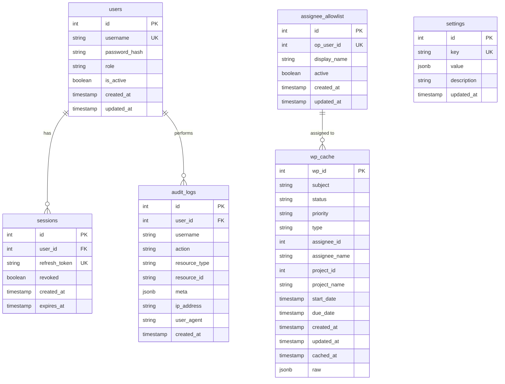

# Database Schema Documentation

## Overview

WorkSLA ใช้ PostgreSQL database เพื่อเก็บข้อมูลระบบ ประกอบด้วย 6 ตารางหลัก

---

## Entity Relationship Diagram (ERD)



---

## Tables

### 1. users

ตารางเก็บข้อมูลผู้ใช้ระบบ

| Column | Type | Constraints | Description |
|--------|------|-------------|-------------|
| id | INTEGER | PRIMARY KEY | รหัสผู้ใช้ (Auto increment) |
| username | VARCHAR(100) | UNIQUE, NOT NULL | ชื่อผู้ใช้ |
| password_hash | VARCHAR(255) | NOT NULL | รหัสผ่านที่เข้ารหัส (bcrypt) |
| role | VARCHAR(20) | NOT NULL, DEFAULT 'viewer' | บทบาท: admin, analyst, viewer |
| is_active | BOOLEAN | NOT NULL, DEFAULT true | สถานะการใช้งาน |
| created_at | TIMESTAMP | NOT NULL, DEFAULT now() | วันที่สร้าง |
| updated_at | TIMESTAMP | DEFAULT now() | วันที่อัปเดตล่าสุด |

**Indexes:**
- PRIMARY KEY (id)
- UNIQUE INDEX (username)

**Sample Data:**
```sql
INSERT INTO users (username, password_hash, role, is_active)
VALUES ('admin', '$2b$12$...', 'admin', true);
```

---

### 2. sessions

ตารางเก็บ refresh tokens สำหรับ authentication

| Column | Type | Constraints | Description |
|--------|------|-------------|-------------|
| id | INTEGER | PRIMARY KEY | รหัส session |
| user_id | INTEGER | FOREIGN KEY → users.id, NOT NULL | รหัสผู้ใช้ |
| refresh_token | VARCHAR(500) | UNIQUE, NOT NULL | Refresh token (JWT) |
| revoked | BOOLEAN | NOT NULL, DEFAULT false | สถานะถูก revoke |
| created_at | TIMESTAMP | NOT NULL, DEFAULT now() | วันที่สร้าง |
| expires_at | TIMESTAMP | NOT NULL | วันที่หมดอายุ |

**Indexes:**
- PRIMARY KEY (id)
- UNIQUE INDEX (refresh_token)
- FOREIGN KEY (user_id) REFERENCES users(id) ON DELETE CASCADE

---

### 3. settings

ตารางเก็บการตั้งค่าระบบ

| Column | Type | Constraints | Description |
|--------|------|-------------|-------------|
| id | INTEGER | PRIMARY KEY | รหัสการตั้งค่า |
| key | VARCHAR(100) | UNIQUE, NOT NULL | Key การตั้งค่า |
| value | JSONB | NOT NULL | ค่า (JSON format) |
| description | VARCHAR(500) | | คำอธิบาย |
| updated_at | TIMESTAMP | DEFAULT now() | วันที่อัปเดต |

**Indexes:**
- PRIMARY KEY (id)
- UNIQUE INDEX (key)

**Sample Settings:**
```json
{
  "key": "OPENPROJECT_BASE_URL",
  "value": {"url": "https://hosp.wu.ac.th/cmms/api/v3"},
  "description": "OpenProject API base URL"
}
```

---

### 4. assignee_allowlist

ตารางเก็บรายชื่อผู้รับผิดชอบที่อนุญาต

| Column | Type | Constraints | Description |
|--------|------|-------------|-------------|
| id | INTEGER | PRIMARY KEY | รหัส |
| op_user_id | INTEGER | UNIQUE, NOT NULL | รหัสผู้ใช้จาก OpenProject |
| display_name | VARCHAR(200) | NOT NULL | ชื่อแสดง |
| active | BOOLEAN | NOT NULL, DEFAULT true | สถานะใช้งาน |
| created_at | TIMESTAMP | DEFAULT now() | วันที่สร้าง |
| updated_at | TIMESTAMP | DEFAULT now() | วันที่อัปเดต |

**Indexes:**
- PRIMARY KEY (id)
- UNIQUE INDEX (op_user_id)

---

### 5. wp_cache

ตารางเก็บ cache ของ Work Packages จาก OpenProject

| Column | Type | Constraints | Description |
|--------|------|-------------|-------------|
| wp_id | INTEGER | PRIMARY KEY | รหัส Work Package |
| subject | VARCHAR(500) | NOT NULL | หัวข้อ |
| status | VARCHAR(100) | | สถานะ |
| priority | VARCHAR(100) | | ระดับความสำคัญ |
| type | VARCHAR(100) | | ประเภท |
| assignee_id | INTEGER | | รหัสผู้รับผิดชอบ |
| assignee_name | VARCHAR(200) | | ชื่อผู้รับผิดชอบ |
| project_id | INTEGER | | รหัสโปรเจกต์ |
| project_name | VARCHAR(200) | | ชื่อโปรเจกต์ |
| start_date | TIMESTAMP | | วันที่เริ่มต้น |
| due_date | TIMESTAMP | | วันที่ครบกำหนด |
| created_at | TIMESTAMP | | วันที่สร้าง WP |
| updated_at | TIMESTAMP | | วันที่อัปเดต WP |
| cached_at | TIMESTAMP | DEFAULT now() | วันที่ cache |
| raw | JSONB | | ข้อมูลดิบจาก API |

**Indexes:**
- PRIMARY KEY (wp_id)
- INDEX (assignee_id)
- INDEX (project_id)
- INDEX (updated_at)
- COMPOSITE INDEX (status, priority)
- COMPOSITE INDEX (assignee_id, status)
- COMPOSITE INDEX (project_id, status)
- INDEX (due_date)

---

### 6. audit_logs

ตารางเก็บ audit logs ของการทำงานในระบบ

| Column | Type | Constraints | Description |
|--------|------|-------------|-------------|
| id | INTEGER | PRIMARY KEY | รหัส log |
| user_id | INTEGER | FOREIGN KEY → users.id | รหัสผู้ใช้ |
| username | VARCHAR(100) | | ชื่อผู้ใช้ |
| action | VARCHAR(100) | NOT NULL | การกระทำ |
| resource_type | VARCHAR(100) | | ประเภททรัพยากร |
| resource_id | VARCHAR(100) | | รหัสทรัพยากร |
| meta | JSONB | | ข้อมูลเพิ่มเติม |
| ip_address | VARCHAR(50) | | IP address |
| user_agent | VARCHAR(500) | | User agent |
| created_at | TIMESTAMP | NOT NULL, DEFAULT now() | วันที่เกิดเหตุการณ์ |

**Indexes:**
- PRIMARY KEY (id)
- INDEX (action)
- INDEX (created_at)
- COMPOSITE INDEX (user_id, action)
- COMPOSITE INDEX (resource_type, resource_id)
- FOREIGN KEY (user_id) REFERENCES users(id) ON DELETE SET NULL

---

## Relationships

1. **users → sessions** (1:N)
   - One user can have multiple active sessions

2. **users → audit_logs** (1:N)
   - One user can have multiple audit log entries

3. **assignee_allowlist → wp_cache** (1:N)
   - One assignee can be assigned to multiple work packages

---

## Database Initialization

```bash
# Initialize database and create tables
docker-compose exec worksla-backend python scripts/init_db.py

# or using Makefile
make migrate
```

---

## Backup & Restore

### Backup

```bash
# Backup entire database
docker exec -t <postgres_container> pg_dump -U apirak.ja -d worksla > backup_$(date +%Y%m%d).sql

# Backup specific tables
docker exec -t <postgres_container> pg_dump -U apirak.ja -d worksla -t users -t sessions > backup_users.sql
```

### Restore

```bash
# Restore database
docker exec -i <postgres_container> psql -U apirak.ja -d worksla < backup_20250101.sql

# Drop and recreate database before restore
docker exec -i <postgres_container> psql -U apirak.ja -d postgres -c "DROP DATABASE IF EXISTS worksla;"
docker exec -i <postgres_container> psql -U apirak.ja -d postgres -c "CREATE DATABASE worksla OWNER apirak.ja;"
docker exec -i <postgres_container> psql -U apirak.ja -d worksla < backup_20250101.sql
```

---

## Performance Considerations

### Indexes

ตารางสำคัญมี indexes เพื่อ optimize queries:

- **wp_cache**: Composite indexes สำหรับ filter/sort ที่ใช้บ่อย
- **audit_logs**: Indexes สำหรับ search logs
- **users**: Unique index บน username สำหรับ login

### Query Optimization

```sql
-- Good: Use indexes
SELECT * FROM wp_cache 
WHERE status = 'Open' AND priority = 'High'
ORDER BY due_date;

-- Good: Filter by indexed columns
SELECT * FROM wp_cache 
WHERE assignee_id = 123 AND status = 'In Progress';

-- Avoid: Full table scan
SELECT * FROM wp_cache 
WHERE LOWER(subject) LIKE '%keyword%';
```

---

## Maintenance

### Clean old audit logs

```sql
-- Delete audit logs older than 90 days
DELETE FROM audit_logs 
WHERE created_at < NOW() - INTERVAL '90 days';
```

### Vacuum and Analyze

```bash
# Run vacuum analyze
docker exec <postgres_container> psql -U apirak.ja -d worksla -c "VACUUM ANALYZE;"
```

---

## Sample Queries

### Get work package statistics

```sql
SELECT 
    status,
    priority,
    COUNT(*) as count
FROM wp_cache
WHERE assignee_id = 123
GROUP BY status, priority
ORDER BY status, priority;
```

### Find overdue work packages

```sql
SELECT 
    wp_id,
    subject,
    assignee_name,
    due_date
FROM wp_cache
WHERE due_date < NOW()
    AND status NOT IN ('Closed', 'ดำเนินการเสร็จ')
ORDER BY due_date;
```

### Get user activity

```sql
SELECT 
    action,
    COUNT(*) as count,
    MAX(created_at) as last_action
FROM audit_logs
WHERE user_id = 1
GROUP BY action
ORDER BY count DESC;
```
